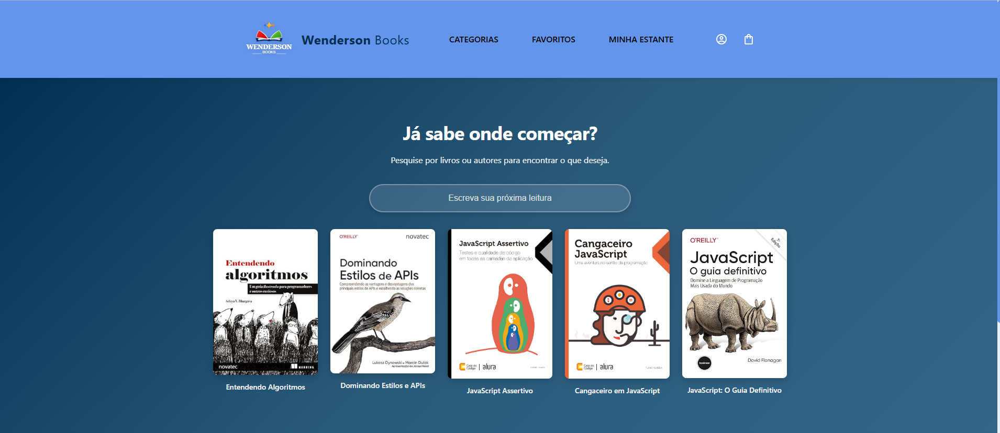
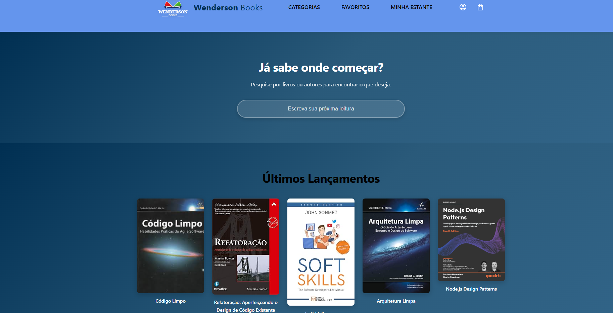
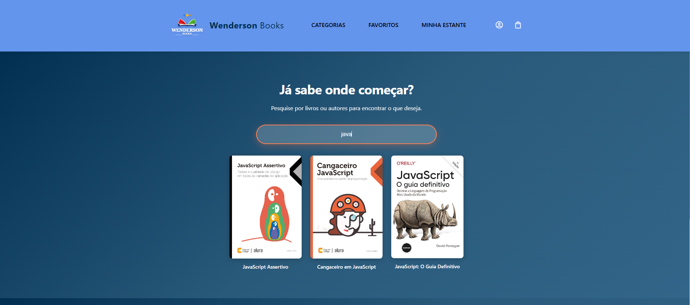

<div align="center">
  
  <h1>📚 Wenderson Books</h1>
  <p><strong>Sua livraria online de tecnologia</strong></p>
  
  
  
  
  
</div>

---

## 📖 Sobre o Projeto

**Wenderson Books** é uma aplicação web moderna de livraria online especializada em livros de tecnologia e programação. Desenvolvida com React e styled-components, oferece uma experiência de usuário fluida com design responsivo e funcionalidades de busca em tempo real.

O projeto foi construído seguindo as melhores práticas de desenvolvimento front-end, com componentização adequada, SEO otimizado e suporte para PWA (Progressive Web App).

### 🎯 Objetivo

Criar uma plataforma intuitiva onde desenvolvedores possam descobrir e explorar livros sobre JavaScript, algoritmos, design patterns e desenvolvimento web.

---

## ✨ Funcionalidades

- ✅ **Busca Inteligente**: Pesquise livros por título com busca case-insensitive ativada ao pressionar Enter
- ✅ **Interface Responsiva**: Design adaptável para dispositivos móveis, tablets e desktops
- ✅ **Última Lançamentos**: Seção dedicada aos livros mais recentes
- ✅ **Efeitos Interativos**: Hover states e animações suaves para melhor experiência do usuário
- ✅ **PWA Ready**: Configurado como Progressive Web App para instalação em dispositivos
- ✅ **SEO Otimizado**: Meta tags Open Graph e Twitter Cards para compartilhamento social

---

## 🚀 Tecnologias Utilizadas

### **Core**
- **[React](https://reactjs.org/)** `18.x` - Biblioteca JavaScript para construção de interfaces
- **[Styled Components](https://styled-components.com/)** `5.3.x` - CSS-in-JS para estilização de componentes

### **Ferramentas de Desenvolvimento**
- **Create React App** - Configuração inicial do projeto
- **React Hooks** - useState para gerenciamento de estado
- **Git** - Controle de versão com Conventional Commits

### **Design e UX**
- Design System com paleta de cores personalizada:
  - `#6495ed` - Azul Cornflower (Principal)
  - `#FF7F50` - Coral (Acentuação)
  - `#002f52` - Azul Escuro (Fundos)
  - `#b0e0e6` - Azul Claro (Backgrounds)
- Tipografia responsiva com função CSS `clamp()`
- Animações e transições suaves (0.3s ease)

---

## 📸 Screenshots

### 🖥️ Tela Inicial - Últimos Lançamentos




### 🔍 Resultados da Pesquisa


> Funcionalidade de busca em tempo real com resultados filtrados dinamicamente

---

## 🛠️ Como Executar o Projeto

### **Pré-requisitos**

Antes de começar, você vai precisar ter instalado em sua máquina:
- [Node.js](https://nodejs.org/) (versão 14 ou superior)
- [Git](https://git-scm.com/)
- Um editor de código como [VS Code](https://code.visualstudio.com/)

### **Instalação**

```bash
# Clone este repositório
git clone https://github.com/Wendersonjose/wenderson-books.git

# Acesse a pasta do projeto
cd wenderson-books

# Instale as dependências
npm install

# Execute a aplicação em modo de desenvolvimento
npm start
```

A aplicação será aberta em [http://localhost:3000](http://localhost:3000) no seu navegador.

### **Build para Produção**

```bash
# Cria uma versão otimizada para produção
npm run build
```

Os arquivos otimizados serão gerados na pasta `build/` e estarão prontos para deploy.

---

## 📂 Estrutura do Projeto

```
wenderson-books/
├── public/
│   ├── index.html          # Template HTML com meta tags SEO
│   ├── manifest.json       # Configuração PWA
│   ├── logo.svg            # Logo do projeto
│   └── logo.png            # Logo alternativo
├── src/
│   ├── components/
│   │   ├── Header/         # Cabeçalho sticky com navegação
│   │   ├── HeaderIcons/    # Ícones de perfil e carrinho
│   │   ├── HeaderMenu/     # Menu de navegação
│   │   ├── Logo/           # Componente do logo
│   │   ├── Input/          # Input reutilizável com estilo
│   │   ├── Pesquisa/       # Componente de busca de livros
│   │   ├── Titulos/        # Componentes de título reutilizáveis
│   │   └── Ultimoslancamentos/ # Seção de últimos lançamentos
│   ├── App.js              # Componente raiz
│   ├── index.js            # Ponto de entrada com estilos globais
│   └── assets/             # Imagens e recursos estáticos
├── package.json
└── README.md
```

---

## 🎨 Padrões de Código

O projeto segue boas práticas de desenvolvimento:

- **Componentização**: Componentes reutilizáveis e com responsabilidade única
- **Styled Components**: Estilização isolada por componente
- **Conventional Commits**: Padrão de commits semânticos
  - `feat:` para novas funcionalidades
  - `fix:` para correções de bugs
  - `docs:` para documentação
  - `chore:` para tarefas de manutenção
- **Responsividade**: Design mobile-first com breakpoints fluidos
- **Performance**: Otimização de imagens e lazy loading

---

## 🔜 Próximas Funcionalidades

- [ ] Sistema de filtros por categoria
- [ ] Carrinho de compras funcional
- [ ] Sistema de autenticação de usuários
- [ ] Integração com API de pagamento
- [ ] Sistema de avaliações de livros
- [ ] Modo escuro/claro
- [ ] Integração com backend (Node.js + MongoDB)
- [ ] Testes automatizados (Jest + React Testing Library)

---

## 👨‍💻 Autor

<table>
  <tr>
    <td align="center">
      <a href="https://github.com/Wendersonjose">
        <br>
        <sub>
          <b>Wenderson</b>
        </sub>
      </a>
    </td>
  </tr>
</table>

**Wenderson José**  
Desenvolvedor Full Stack  

[](https://www.linkedin.com/in/wenderson-jose)
[](https://github.com/Wendersonjose)
[](mailto:wenderson.jose@exemplo.com)

---

## 📄 Licença

Este projeto está sob a licença MIT. Veja o arquivo [LICENSE](LICENSE) para mais detalhes.

---

## 🙏 Agradecimentos

- [Alura](https://www.alura.com.br/) - Curso Full Stack
- [Create React App](https://create-react-app.dev/) - Configuração inicial
- [Styled Components](https://styled-components.com/) - Documentação e exemplos
- Comunidade React Brasil

---

<div align="center">
  <p>Desenvolvido com ❤️ por Wenderson</p>
  <p>⭐ Deixe uma estrela se este projeto te ajudou!</p>
</div>
